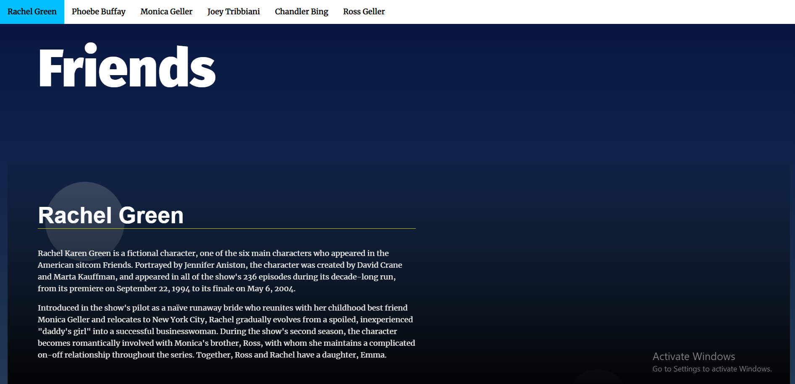
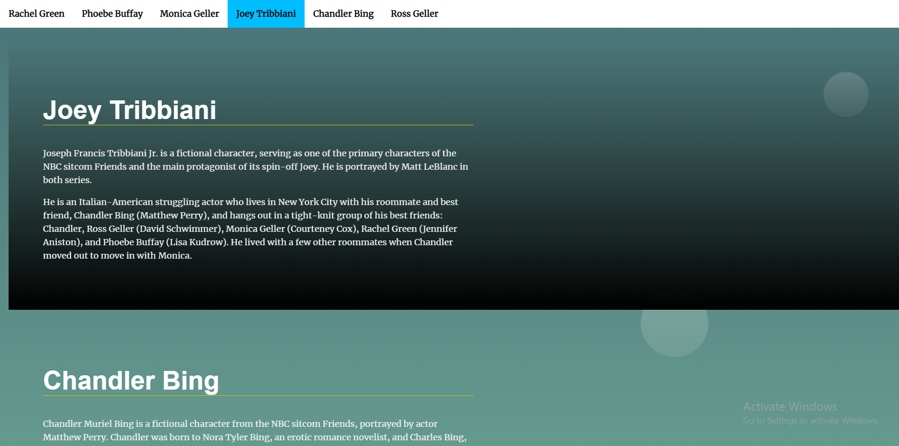

# Landing Page

## Table of Contents

* [Features](#features)
* [Images](#images)

## Features

* As navigation is built dynamically, sections can be added and deleted from html file without affecting the navigation functionality.

* Clicking any Item form navigation bar scrolls to the corresponding section.

* Styles are added to both sections and navigation items to indicate which section is in view.

## Images

